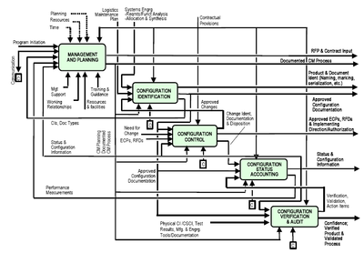

Configuration management is essential when it comes to programming with a group. If you do not have some type of configuration management there is no way to ensure that all of the programmers working on a project or on the same version of the project. It is also impossible to ensure that there is no collisions when it comes to two programmers testing on the same blocks of code. When using configuration management you at least ensure that the programmers are able to test locally without getting in the way of the other programmers.

