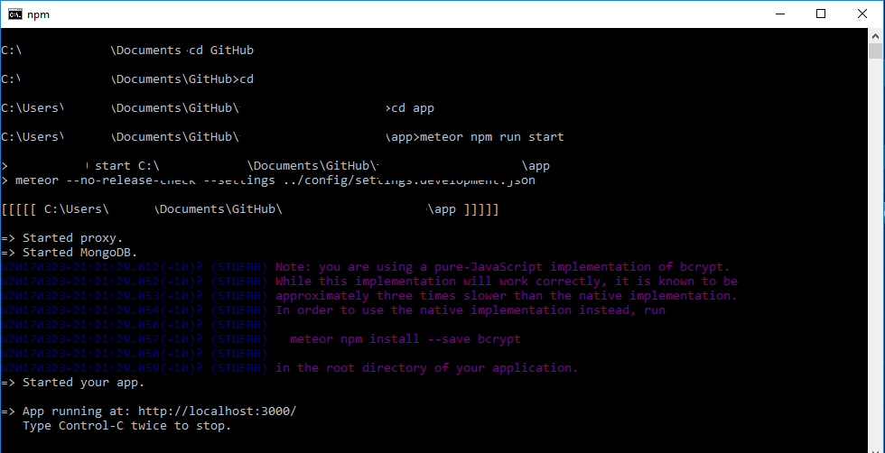

There is, hands down, no better way to explain my experience with meteor. As my title shows, 
my first couple of days using the meteor architecture. Meteor has to be one of the most confusing 
architectures to begin using, with so many different files to download and run you may give up halfway through 
setup. However if you can fight your way through the initial setup you will find that Meteor is one of the funnest and 
most interesting architectures to use. 

## Getting Started

When you first start to setup Meteor you may notice something about Meteor. Loading takes time, a lot of time. In fact you may find yourself sitting around doing nothing for quite a long time when you first begin to set up Meteor. On the bright side it does get faster when you start building projects, but not by much. 

Above is a screen you should get familiar with as you will spend a lot of time looking at it. With whispers of a patch with faster loading speeds in the air, it has yet come to the general public. 

