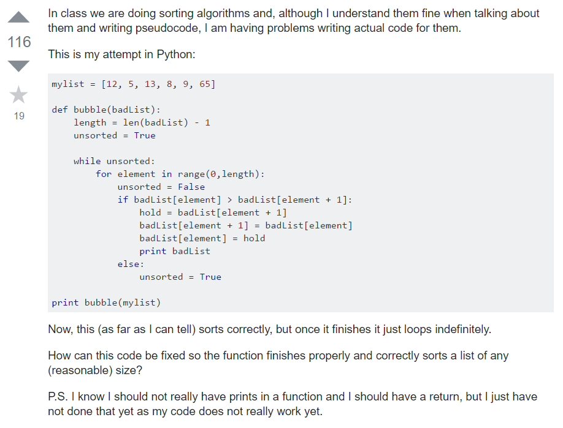
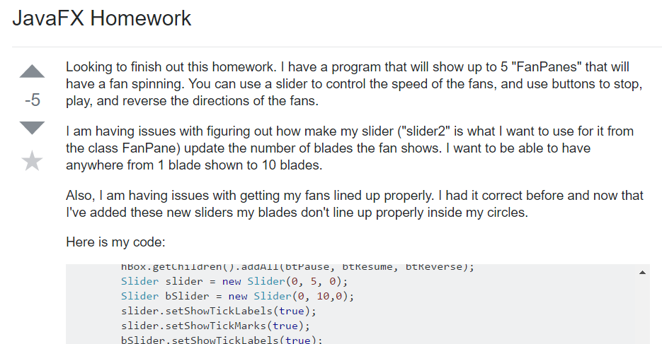

Asking the right questions is one of the core things that you will need to know if you plan on going to go into the computer science fields. Though this is an important skill to have no matter what field you plan on going into you will need it more so when it comes to either reading code or writing it. Now you may wonder why it is so important to need to know how to ask questions in the first place. It is mostly impossible to know every detail about every component in all languages so you will one day need to ask someone for help. When it comes to that you will need to know what to tell them to get the kind of help you really need. In many cases when you ask the right kind of question you will get a fast and succinct answer. However, if you ask the wrong kind of question you may find yourself in a forum where no one wants to or can help you due to the confusing way that you asked your question.
	Now you may be wondering how to ask the right kind of questions, or as some people call them “smart questions”. Well all smart questions have something in common. All of them are well thought out and formatted in a way that is easy for those reading to comprehend what kind of question you are asking. An example that you may see for someone who is asking a smart question would be something like this.

  

http://stackoverflow.com/questions/895371/bubble-sort-homework

As you can see, the users’ questions were short and to the point. They are not asking the other users to do the work for them but rather want a clue or hint to point them into the right path. One major mistake that many people make when asking questions on public forums like this is to ask the other users to do the work for them, or in some cases ask questions that they could have easily found the answer for.  Here we see that the user has well formatted pseudo code to show the other users that they have made an attempt to do the work and are just stuck in a small portion of the code. The following is an example of a bad question.

  

http://stackoverflow.com/questions/34006885/javafx-homework
As you can see the user asked a question that was relatively simple. They also asked it in a way that sounded like they were trying to get the other users to do the work for them. The work that they have posted is also badly formatted making the users who are trying to help them work much harder than they should have to. When asking good questions one thing that you need to remember is that these questions are nothing more than hints to point you into the right direction. You are not asking the other users to do the work for you. 
Asking the right kind of questions will be crucial for your success, not only in the computer science industry but in everything that you plan to do in the future. If you learn how to ask the right kinds of questions, then you will receive very fast and precise answers that will speed you on your way. However, asking the wrong kind of questions will make your life and the lives of those who are trying to help you much more difficult than it needs to be.

