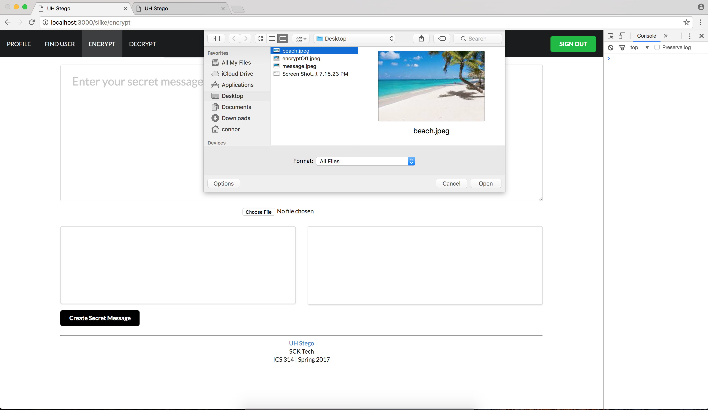
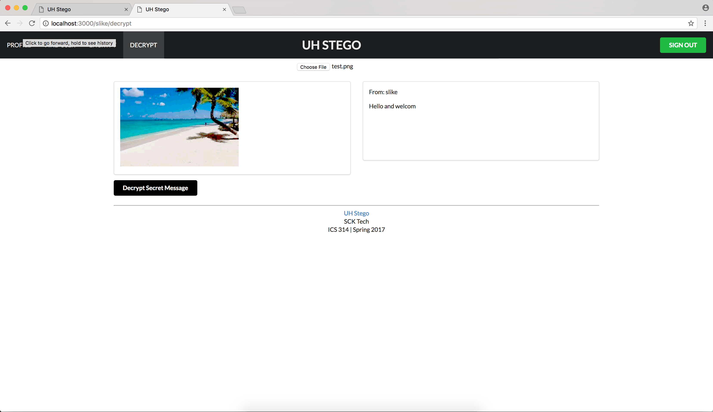

# UH Stego

## What is UH Stego?

As students, many wish to communicate with others through other mediums besides face to face. However some topics or ideas may not always be safe to publicly spread, especially in a form where everyone has the ability to view it. UH Stego gives University of Hawaii students the ability to embed messages into images so students and staff can communicate in a discreet and private way.

## Building UH Stego

UH Stego was a collaborative project with other talented programmers. Together we successfully managed to distribute tasks and fix bugs without any real form of central leadership due to Git. Using the MileStones as "Due Dates" for our individual features we were able to complete the application on schedule with little rush.

Above are two versions of the same image. The Image on the left is the original while the image on the right has embedded text in it. My role in UH Stego was to create the Encrypt and Decrypt pages of the application. While the application does not technically encrypt or decrypt data we used these terms because of their current popularity to increase the marketability of the application. We worked to create a simple user interface to encode messages into images and read messages that have been sent to you through other media.

  

  
  

  

  
  

## My Experience with Stego

Overall this was a great experience to create on of the many tools that are becoming more popular while the future of free speech becomes less guaranteed. While it was daunting to be put into a situation to use new technology such as Mongo DB, I believe that I have grown as a programmer by expanding the amount of tools I am familiar with.

Using Github has been a humbling and eye opening experience. Being able to see submissions by my talented co-programmers I was able to see other trouble shooting techniques as well as coding styles merging with my own to create an application that I believe will be useful in the future of free speech. While there was some complications early in the development process I believe that working as a team truly makes programmers perform at their best.

You can learn more at: [UH Stego.](https://scktech.github.io/)

You can also visit my team members’s portfolios:

[Sam Rasay](https://samrasay.github.io/)

[Kurt Nikaitani](https://kknikk.github.io/)
