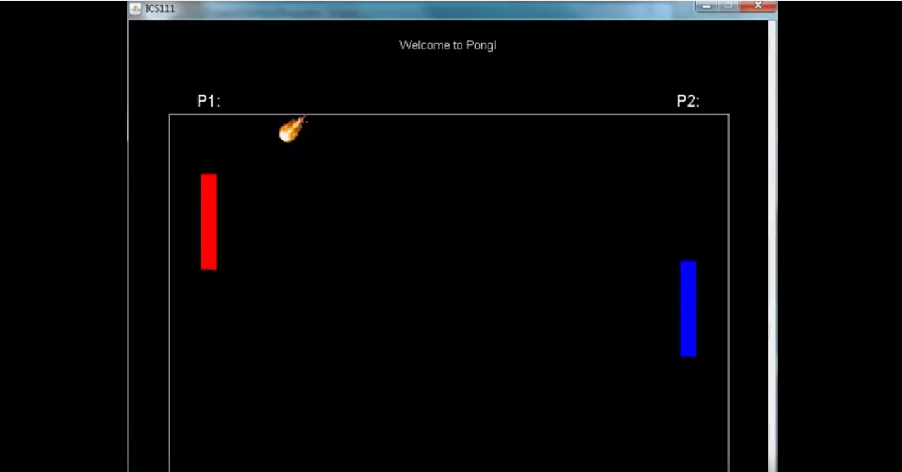
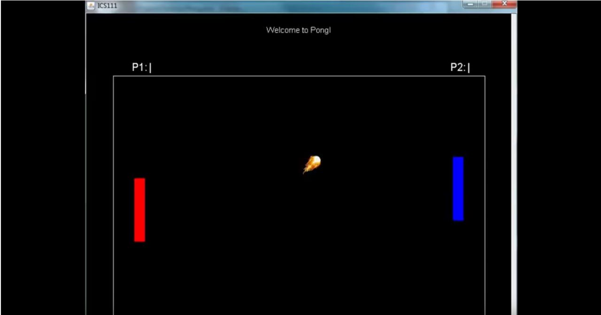
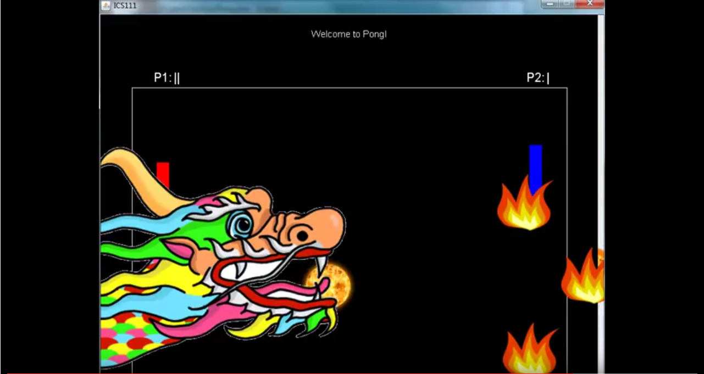

  
  
  

The purpose of this project was to learn basic programming and video game design using the EZ java library. The project itself was ment to practice implenting live commands and practice basic syntax and command line programming.

Overall the pong game was a goood way for students to learn the benefits of using runtime command line arguments. 

You can watch the game played on [Youtube](https://www.youtube.com/watch?v=Iy7d7j49Gvs).

