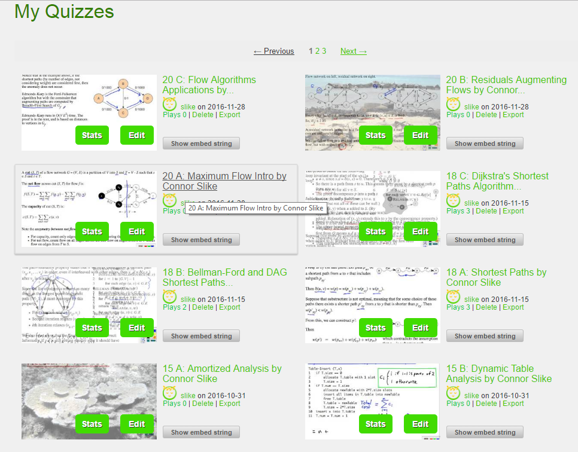
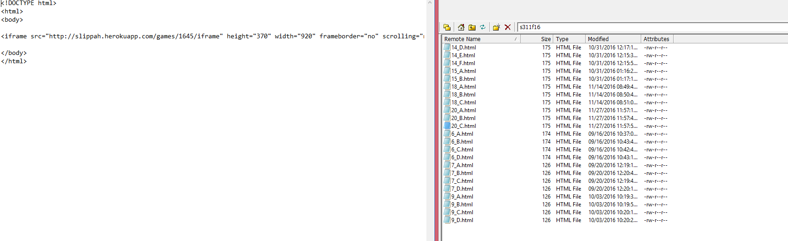

  
  

Slippah is an interactive quiz taking website created by the teacher of ICS 311. This website focused on creating a fun and interactive way for students to learn material in a quiz like fashion while being able to view the material while taking the test itself. In this case it heled the students of 311 learn about algorithms while being engaged with the videos we studied from.

In this case we mainly used HTML to code the video into our personal websites hosted by the University of Hawaii. in order to create the video we had to upload a link from youtube into the slippah website. From there the website let us create a quiz, and link that quiz to the video we were basing it off of. We simply linked the video quiz from slippah to our personal website to allow students to take the quiz in an easy and efficiant manner.

This project was very useful in teaching the students the practical applications of javascript and html. Even though the students themselves did no javascript programming we got to see how you can use it to enhance the user experience and help others learn a concept in a efficent and fun manner.  
 
You can try an interactive game here [Link](http://www2.hawaii.edu/~slike/ics311f16/).
