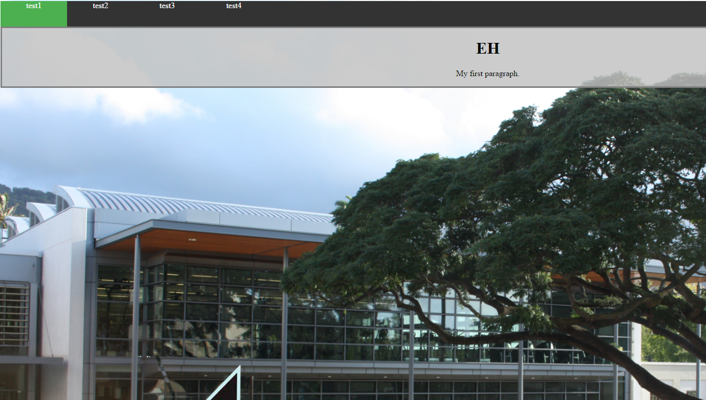

  

This is the beginning of a website I was practicing HTML and CSS programming. The original purpose of this was to take a complex problem such as scheduling a work week for workeres and making it into a easy to follow, well formated page. 

You can view the webpage here  [Link](http://www2.hawaii.edu/~slike/schedule/home.html).
